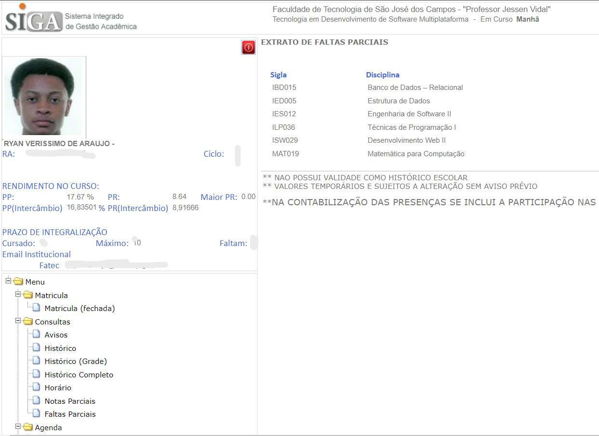

# Infrações de heurísticas de usabilidades e interface
#####
## Heurística - 5 (Prevenção de erros)

#### Não apresenta a forma que deve ser inserido o telefone
#####
## Heurística - 6 (Reconhecimento ao invés de lembrança)

#### Não deixa claro para o usuário em qual secção do sistema ele se encontra

#### Não deixa claro para o usuário em qual secção do sistema ele se encontra
#####
## Heurística - 8 (Design estético e minimalista)

#### Interface poluída

#### Interface poluída

#### Design ultrapassado e não estético
#####
## Heurística - 10 (Ajuda e docoumentação)

#### O sistema não oferece documentação ou ajuda para o usuário
